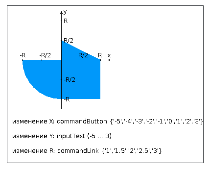

# ITMO SE Lab3 Web Programming
```task: 2935```

## TODO

Разработать приложение на базе JavaServer Faces Framework, которое осуществляет проверку попадания точки в заданную 
область на координатной плоскости

----------------------------------------------------------------------------------------------------------------------

## Architecture

- Стартовая страница (facelet шаблон):
  - Шапка, содержащая ФИО студента, номер группы и номер варианта
  - Интерактивные часы, показывающие текущие дату и время, обновляющиеся раз в 7 секунд
  - Ссылку, позволяющую перейти на основную страницу приложения

- Основная страница приложения (facelet шаблон):
  - Набор компонентов для задания координат точки и радиуса области
  - Client-side валидация
  - Интерактивный элемент, изображающий область на координатной плоскости
    - Клик по картинке инициирует сценарий, осуществляющий определения координат новой точки отправку их на сервер
    - Цвет точек должен зависеть от факта попадания / непопадания в область
    - Смена радиуса также должна инициировать перерисовку картинки
  - Таблица со списком результатов предыдущих проверок
  - Ссылка, позволяющая вернуться на стартовую страницу

- Набор управляемых bean'ов, реализующих логику на стороне сервера

----------------------------------------------------------------------------------------------------------------------

## Area


----------------------------------------------------------------------------------------------------------------------

## Requirements

- Все результаты проверки должны сохраняться в PostgreSQL
- Для доступа к БД необходимо использовать JPA с Hibernate
- Для управления списком результатов должен использоваться Session-scoped Managed Bean
- Конфигурация управляемых bean'ов должна быть задана с помощью аннотаций
- Правила навигации между страницами приложения должны быть заданы в отдельном конфигурационном файле

----------------------------------------------------------------------------------------------------------------------

## Defence questions
- Технология JavaServer Faces. Особенности, отличия от сервлетов и JSP, преимущества и недостатки. Структура JSF-приложения
- Использование JSP-страниц и Facelets-шаблонов в JSF-приложениях
- JSF-компоненты - особенности реализации, иерархия классов. Дополнительные библиотеки компонентов. Модель обработки событий в JSF-приложениях
- Конвертеры и валидаторы данных
- Представление страницы JSF на стороне сервера. Класс UIViewRoot
- Управляемые bean'ы - назначение, способы конфигурации. Контекст управляемых bean'ов
- Конфигурация JSF-приложений. Файл faces-config.xml. Класс FacesServlet
- Навигация в JSF-приложениях
- Доступ к БД из Java-приложений. Протокол JDBC, формирование запросов, работа с драйверами СУБД
- Концепция ORM. Библиотеки ORM в приложениях на Java. Основные API. Интеграция ORM-провайдеров с драйверами JDBC
- Библиотеки ORM Hibernate и EclipseLink. Особенности, API, сходства и отличия
- Технология JPA. Особенности, API, интеграция с ORM-провайдерами